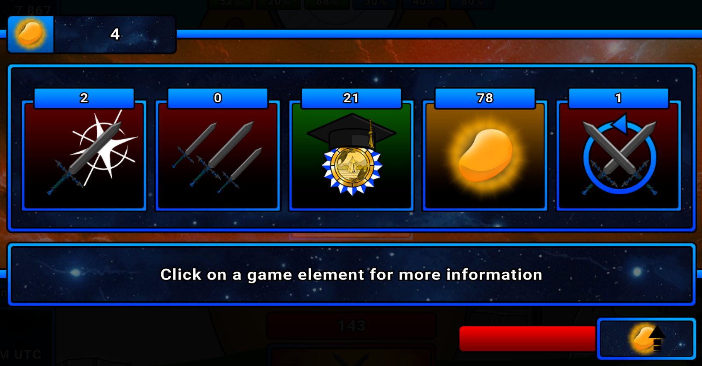

# Input

### BOSS Level

In the game, you will see an interface like this at the top.


We only need to focus on the middle line `The Path Macker(T37)`, where `T37` represents the BOSS level.

### Level

In the top-left corner of the game, there is an interface like this.


Here, `34` is your level, and `340` is the experience value under your current level's experience bar.

### GP/Points

Open the points allocation interface.



The number in the top-left corner represents your available gp. The five numbers in the middle represent your allocated points.

You can input point allocations using the following formats:

```txt
1 2 3 4 5
1,2,3,4,5
1.2.3.4.5
1-2-3-4-5
```

As long as the numbers are separated by non-digit characters, the system will automatically recognize them. If you enter too many or too few numbers, the system will automatically correct them to five numbers, with missing values defaulting to 0.

### Build Comparison


To the right of your points, there's a build comparison feature. On the top, there's a checkbox which, if checked, affects the result of **GP-to-points calculation and cost checking**.

Below that, there's a text box where you can input your opponent's point allocation. By default, your opponent's level is the same as yours, but you can override it by adding a pair of parentheses after the points.

### BUFF Calculation

In the game, you'll see these buffs with a green bottom border.


These three represent the attack buff, experience buff, and gold potato buff. They can be expanded:


Click to reveal the number of gold souls. The total is then calculated using the formula from the website to get the buff values.

### Leaderboard


Open the leaderboard to view the top 1000 rankings and their damage values. If you can't find the damage for rank `n`, try lowering `n` a little in case of ties.

Similar to point allocation, if you enter fewer or more than seven numbers, the system will automatically correct to exactly seven values, filling in with 0s where needed.

# GP to Points Calculation

### Standard Calculation


Once the input section above is filled out, you can begin the calculation. The standard calculation attempts to **spend your GP as much as possible** and outputs the possible point allocations along with projected damage and ranking benefits.

The numbers in parentheses after GP gain and EXP gain represent projected values for the **next round**.

The number in parentheses after damage represents projected values for the **this round**.

If there are too many simulated results, the system will automatically truncate to the top 1000 results. You can expand them if necessary (though it's not recommended).

### Include Upgrades in Calculation


If your point allocation has a particular focus (like economy or damage), the image above shows five toggle buttons for different upgrades. **Blue indicates active**. Inactive upgrades will be skipped in the next calculation to reduce the search space.

### Build Comparison


If you enabled build comparison, the values for `damage, GP gain, and EXP gain` will show the **difference between your build and the opponent’s build**.

### Quick Input


The system now supports quick point input. Your simulated builds are now clickable — clicking one will directly fill the upper input fields with the simulated **GP, EXP, level, and points**, making it easier to re-run the simulation.

Priority Sorting


At the top of the results section, you can sort based on different priorities:

+ Damage: Sort by damage in descending order.
+ Efficiency: Sort by damage efficiency in desending order.
+ GP: Sort by gp in descending order; if equal, sort by damage in descending order.
+ Exp: Sort by experience in descending order; if equal, sort by damage in descending order.
+ Rest GP: Sort by rest gp in ascending order; if equal, sort by damage in descending order.

# Show Cost


This shows the cost of your current point allocation, the cost-efficiency of attacks, and your future point allocation needs. At the bottom of the future allocation, there's a continue button to view further.

### Build Comparison


If you enabled build comparison, this will show the **difference in costs** between the two builds. Also, if you forced a level for the opponent, it will additionally show **EXP gap** between you and the opponent.

# Damage to Points

### Input


Based on the current situation, you can reverse-infer a player's build based on their damage. Enter multiple damage values separated by non-digit characters. You can also limit the cost to reduce search space.

Since level affects damage, you must fill in a level range to try.

### Calculation


The calculation will reverse-infer a build and determine how much economy is needed to catch up, based on your current allocation.

