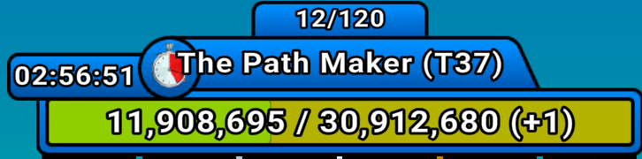

# Input

### BOSS Level

In the game, you will see an interface like this at the top.



We only need to focus on the middle line `The Path Macker(T37)`, where `T37` represents the BOSS level.

### My Level

In the top-left corner of the game, there is an interface like this.


Here, `34` is your level, and `340` is the experience value under your current level's experience bar.

### My gp/Points

Open the points allocation interface.


The number in the top-left corner represents your available gold potatoes. The five numbers in the middle represent your allocated points.

Regarding point allocation input, you can use any of the following formats:

```txt
1 2 3 4 5
1,2,3,4,5
1.2.3.4.5
1-2-3-4-5
```

As long as the numbers are separated by non-numeric characters, the system can automatically recognize them. If you enter more or fewer numbers than required, the system will automatically adjust it to five numbers, filling in missing values with `0`.

### BUFF Calculation

In the game, you will see buffs with a green bottom border.


These three represent the attack buff, experience buff, and gold potato buff, respectively. These can be clicked to expand:


Clicking on them reveals the amount of gold souls. The total amount is then calculated using the formula provided on the website to determine the buff values.

### Leaderboard


Opening the leaderboard allows you to view the ranking data of the top 1000 players and their damage values. If you cannot find the damage corresponding to the `n`-th rank, try slightly decreasing `n` to check, as ranks may be tied.

Similar to point allocation, if you enter fewer or more than seven numbers, the system will automatically adjust by filling in or truncating the input to exactly seven numbers, with missing values set to `0`.

<div STYLE="page-break-after: always;"></div>

# GP to Points Calculation

### Standard Calculation


After filling in the input data from the previous section, you can start the calculation. The standard calculation will attempt to **spend all your gold potatoes optimally** to determine your potential point allocation and calculate your gains in terms of damage and ranking.

The values in parentheses after "get gp" and "get exp" indicate the estimated amount of gold potatoes/experience you will have in the next round.

### Calculation Including Upgrades


When you have a specific point allocation preference (e.g., focusing on economy or damage), click this button to ensure the calculation only includes these upgrade options.

### Build Comparison


This function allows you to compare all your point allocations against a target build, making it easier to compare calculations efficiently and compare with others.


# Show Cost


This feature allows you to view the cost of your current point allocation, the cost-effectiveness of attack upgrades, and future point allocation needs.

# Damage to Points

### Input


Based on the current game state, you can infer a player's point allocation by entering multiple damage values separated by non-numeric characters. You can also set a spending limit to reduce search space and improve calculation efficiency.

Since level affects damage, the inferred points are based on the `My Level` input.

### Calculation


The calculation will infer the player's point allocation and determine the amount of gold potatoes needed to catch up based on your current allocation.

