# 输入

### BOSS等级

在游戏里面你会在最上方看到这样的界面。

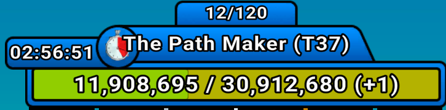

我们只需要关注最中间的那行`The Path Macker(T37)`，这里的T37就是BOSS的等级。

### 等级

在游戏的左上方有这么一个界面。


其中的34就是你的等级，340就是你当前等级经验条下的经验值。

### 金豆/加点

点开加点界面。

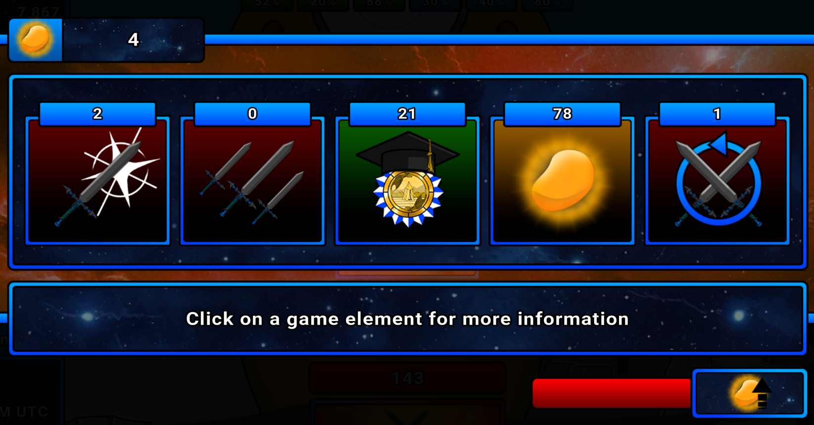

左上角的就是你现有的金豆数量，中间的五个数字就是你的加点。

关于加点的输入你可以有以下的方式：

```txt
1 2 3 4 5
1,2,3,4,5
1.2.3.4.5
1-2-3-4-5
```

只要数字之间用非数字字符隔开系统就能自动识别，如果你填多了/填少了系统会自动帮你纠正到5个而且缺省的数字默认填成0。

### 比较加点

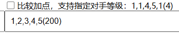

在你的加点右侧，有一个比较加点功能，上面有一个勾选框，如果勾选会影响**金豆计算加点和查看消耗**的结果。

下面有一个文本框，里面可以存放对手的加点。对手的等级**默认跟你的等级相同**，如果要制定对手的等级可以在加点后面放一对括号强制制定对手等级。

### BUFF计算

在游戏中你会看到这样的buff，它们的最底框是绿色。

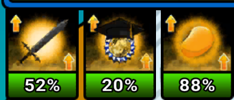

这三个分别代表了攻击buff、经验buff和金豆buff，这三个是可以点开的：

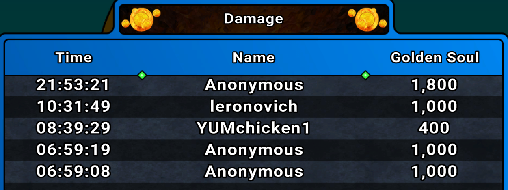

点开就可以看到金魂的数量，然后计算总量后按照网站上的公式计算得到buff。

### 排行榜

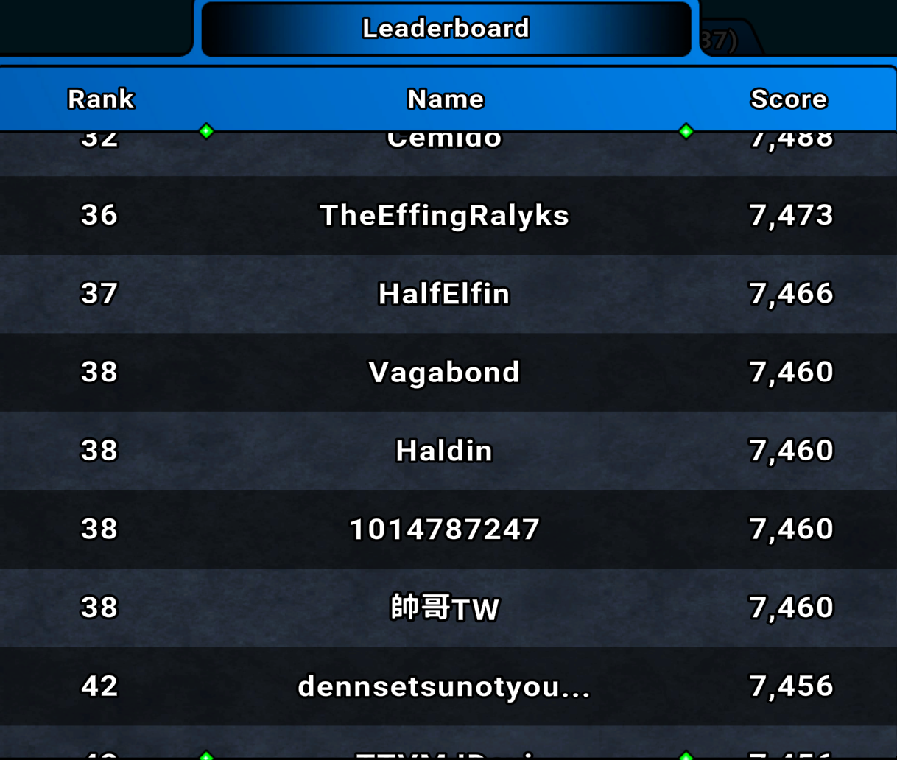

点开排行榜就能查看到前1000名的排名数据以及它们的伤害，如果你找不到第n个排名对应的伤害，那么把n稍微减小看看能不能找到，因为是并列的原因。

跟加点一样，如果你输入的数字不是7个，就会自动帮你补充/截断到7个，补充的部分填0。

# 金豆计算加点

### 计算加点

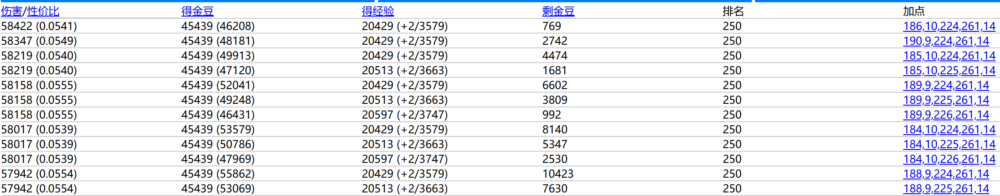

将上面输入部分数据填好后就可以开始计算了，普通计算会在**尽可能**花光你的金豆的情况下计算你可能的加点情况并按照伤害和排名计算你这轮的收益。

其中得金豆和得经验后面的**括号**是计算你下轮的金豆/经验情况，伤害后面的**括号**是计算这轮你点伤害的性价比。

如果模拟出来的结果太多，系统会自动截断到1000前1000条，当然你也可以展开（不推荐就是了）。

### 计算包含升级项


当你加点有一定的倾向性时（比如有时候集中经济，有时候集中伤害）。上图一共有五个按钮分别代表不同的升级项，**蓝色代表激活**，没激活的升级项会在下次计算中直接被忽略，减少搜索空间。

### 比较加点

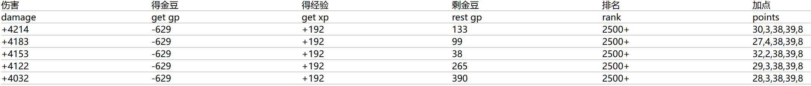

如果你勾选了加点比较，那么`伤害，得金豆和得经验`这三项就会显示出加点完你跟对手的加点的差距。

### 按照比率花费


如果你需要按照比率进行花费，就可以勾选勾选框，然后输出的结果自动会按照贴近花费比率的方式排序。

### 快速输入

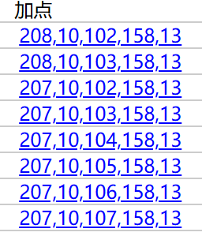

现在该系统支持加点快速输入，现在加点是可点击的，如果点击可以直接将模拟出来的**金豆、经验、等级和加点**同步到上方的输入框，方便下一次模拟。

### 优先级排序

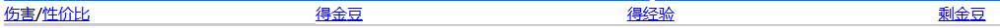

在结果的最上面这栏，可以支持按照一定的优先级排序：

+ 伤害：按照伤害从大到小排序
+ 性价比：按照伤害性价比从大到小排序
+ 金豆：按照金豆从大到小排序，相同金豆伤害从大到小排序
+ 经验：按照经验从大到小排序，相同经验伤害从大到小排序
+ 剩余金豆：按照剩余金豆从小到大排序，相同剩余金豆伤害从大到小排序

# 查看消耗

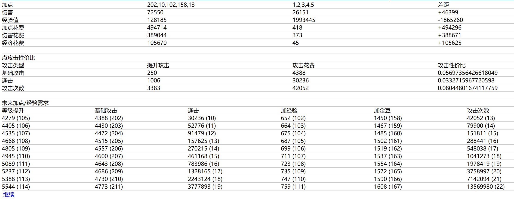

这个能够查看你当前加点的消耗，攻击的性价比和未来加点需求（未来加点需求的最下方有个继续按钮可以接着查看）

### 比较加点

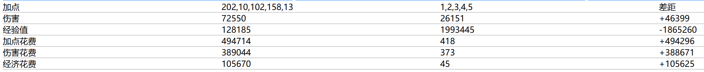

如果你勾选了比较加点，那么该功能展示出比较两个加点之间的消耗差距。这里需要强调的是，如果你强制制定了对手的等级，比较加点还会显示出跟对手的经验值差距。

# 伤害可能加点

### 输入

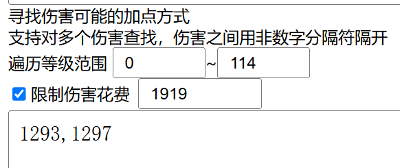

根据当前局势上的情况你可以通过伤害反推某个人的加点，输入若干个伤害，中间用非位数字字符隔开，然后你还可以限制花费节省搜索解空间的时间。

由于等级会影响伤害，所以需要在遍历等级范围处填写等级的范围。

### 计算

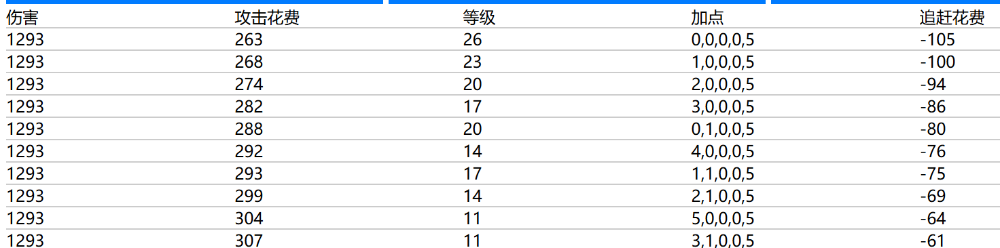

计算会反推加点，还能根据你目前的加点计算追赶要花多少经济。